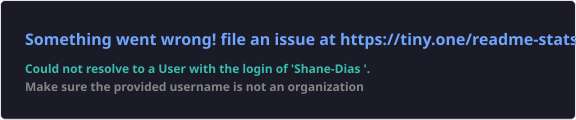

 

---

## 🧑‍💻 About Me

🎓 **B.E. Computer Engineering** @ Fr. Conceicao Rodrigues College of Engineering, Mumbai

🚀 I build full-stack web apps — from AI-powered safety platforms and serverless AWS pipelines to role-based project portals and Spring Boot backends.

- 🔭 Currently working on: deepening my cloud-native & backend architecture skills
- 🛠️ Stack of choice: MERN, Spring Boot, AWS
- 🏆 5x Hackathon Winner — Tech-Mania 2K25, FullStack.AI, Code Storm 2025, Oscillation 2K25, Saksham Ideathon '25
- 💬 Ask me about: REST APIs, system design, mapping APIs, or full-stack deployment
- 📫 Reach me at: **shanedias0111@gmail.com**

---

## 💻 Tech Stack

#### 🖥️ Languages

#### 🎨 Frontend

#### ⚙️ Backend

#### 🗄️ Databases

#### ☁️ Cloud & DevOps

#### 🛠️ Tools

---

## 🚀 Featured Projects

<table>
  <tr>
    <td width="50%" valign="top">
      <h3>☁️ Cloud Sentry</h3>
      
Event-driven serverless threat detection pipeline on AWS — auto-scans uploads, computes SHA-256 hashes, logs threats to DynamoDB, and broadcasts real-time alerts via SNS with Zero-Trust IAM architecture.

      

        
        
        
        
        
      

      <a href="https://github.com/Shane-Dias/Cloud-Sentry">🔗 View Project</a>
    </td>
    <td width="50%" valign="top">
      <h3>🛡️ BharatSecure</h3>
      
Web-based incident reporting & response platform improving public safety through anonymous reporting, real-time alerts, interactive heatmap analytics, and SOS with live location tracking.

      

        
        
        
        
        
      

      <a href="https://github.com/Shane-Dias/BharatSecure">🔗 View Project</a>
    </td>
  </tr>
  <tr>
    <td width="50%" valign="top">
      <h3>✈️ TravelSafe AI</h3>
      
AI-powered travel safety platform with real-time safety analysis, route planning, weather alerts, SOS features, and trip management — powered by Google Generative AI and interactive mapping.

      

        
        
        
        
        
        
        
      

      <a href="https://github.com/Shane-Dias/TravelSafe-AI">🔗 View Project</a>
    </td>
    <td width="50%" valign="top">
      <h3>🌟 BrightBuilds</h3>
      
Centralized project showcase platform connecting students, faculty, and administrators through submission & review workflows with JWT auth, role-based access, and full REST API coverage.

      

        
        
        
        
        
        
      

      <a href="https://github.com/Shane-Dias/BrightBuilds">🔗 View Project</a>
    </td>
  </tr>
  <tr>
    <td colspan="2" align="center" valign="top">
      <h3>🍽️ Recipe Manager</h3>
      
Spring Boot backend application integrating the Spoonacular API for recipe management and user preferences, with Spring AOP custom logging for performance metrics and Spring Data JPA for relational data persistence.

      

        
        
        
        
        
      

      <a href="https://github.com/Shane-Dias/RecipeManager">🔗 View Project</a>
    </td>
  </tr>
</table>

---

## 🏆 Achievements

| 🥇 1st Place | 🥇 1st Place | 🥇 1st Place | 🥈 1st Runner-Up | 🥉 3rd Place |
|:---:|:---:|:---:|:---:|:---:|
| **Tech-Mania 2K25** | **FullStack.AI Hackathon** | **Code Storm 2025** | **Oscillation 2K25** | **Saksham Ideathon '25** |

---

<!-- ## 📊 GitHub Stats

  
  

  

  

---

## 🔝 Top Contributed Repos

  

--- -->

## 🐍 Contribution Snake

  

---

## 📫 Let's Connect

